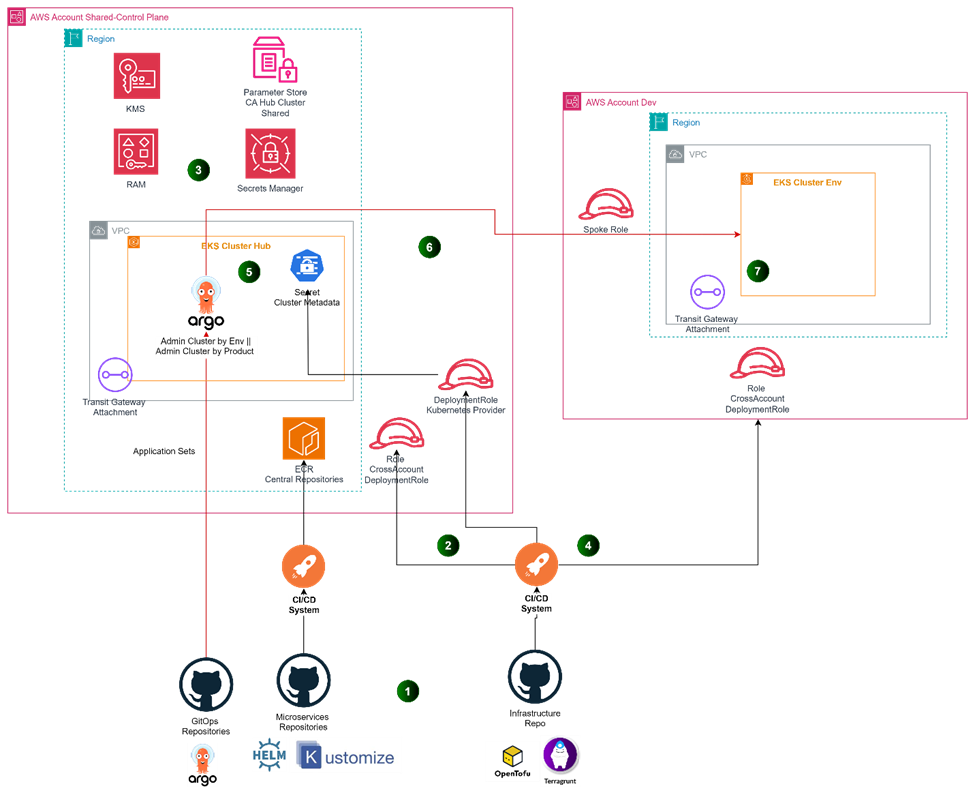

# AWS GitOps Blueprint with Terragrunt

This project provides a blueprint for implementing GitOps on AWS using Terragrunt and Argo CD. It offers a structured approach to managing infrastructure as code and deploying applications across multiple environments.

The blueprint is designed to streamline the process of setting up a GitOps workflow on AWS, leveraging Terragrunt for managing Terraform configurations and Argo CD for continuous deployment. It includes configurations for essential AWS services such as EKS (Elastic Kubernetes Service) and VPC (Virtual Private Cloud), as well as GitOps components for managing cluster addons and platform-level resources.

Key features of this blueprint include:
- Modular infrastructure setup using Terragrunt
- EKS cluster configuration for container orchestration
- VPC network setup for secure and isolated environments
- GitOps bridge for seamless integration between infrastructure and application deployments
- Argo CD ApplicationSets for managing cluster addons and platform resources
- Environment-specific configurations for multi-environment deployments

## Repository Structure

```
terragrunt_aws_gitops_blueprint/
├── common/
│   └── variables.tf
├── infrastructure/
│   ├── containers/
│   │   ├── eks_control_plane/
│   │   │   └── README.md
│   │   └── gitops_bridge/
│   │       ├── bootstrap/
│   │       │   ├── addons.yaml
│   │       │   └── platform.yaml
│   │       ├── data.tf
│   │       └── outputs.tf
│   └── network/
│       └── vpc/
│           └── README.md
└── README.md
```

Key components:
- `common/variables.tf`: Defines common variables used across the project
- `infrastructure/containers/eks_control_plane`: Contains EKS cluster configuration
- `infrastructure/containers/gitops_bridge`: Manages the GitOps integration
- `infrastructure/network/vpc`: Handles VPC configuration
- `infrastructure/containers/gitops_bridge/bootstrap`: Contains Argo CD ApplicationSet configurations for cluster addons and platform resources

## Infrastructure diagram


> Please visit [](dev.to) for more.

## Usage Instructions

### Prerequisites

- AWS CLI configured with appropriate permissions
- OpenTofu v1.8.0 or later
- Terragrunt v0.71.1 or later
- kubectl v1.30.5 or later
- ArgoCD CLI


### Installation

1. Clone the repository:
   ```
   git clone <repository_url>
   cd terragrunt_aws_gitops_blueprint
   ```

2. Initialize Terragrunt:
   ```
   terragrunt init
   ```

3. Review and adjust the configuration in `terragrunt.hcl` files as needed.

4. Apply the Terragrunt configuration:
   ```
   terragrunt run-all apply
   ```

### Configuration

The project uses Terragrunt to manage environment-specific configurations. Key configuration files include:

- `terragrunt.hcl` files in each subdirectory for module-specific configurations
- `common/variables.tf` for shared variables
- `infrastructure/containers/gitops_bridge/bootstrap/*.yaml` for Argo CD ApplicationSet configurations

### GitOps Workflow

1. The EKS cluster is provisioned using Terragrunt.
2. Argo CD is installed on the cluster.
3. The GitOps bridge component deploys Argo CD ApplicationSets for cluster addons and platform resources.
4. Subsequent changes to the infrastructure or applications are managed through Git repositories and automatically synced by Argo CD.

### Troubleshooting

1. Issue: Terragrunt fails to apply changes
   - Error message: "Error: Unable to assume role"
   - Diagnostic steps:
     a. Check AWS CLI configuration
     b. Verify IAM permissions
     c. Ensure the specified role exists and is accessible
   - Debug command: `AWS_SDK_LOAD_CONFIG=1 terragrunt run-all apply --terragrunt-log-level debug`

2. Issue: Argo CD ApplicationSet not syncing
   - Error message: "Unable to create Application: application spec is invalid"
   - Diagnostic steps:
     a. Check the ApplicationSet YAML for syntax errors
     b. Verify that the specified Git repository is accessible
     c. Ensure the cluster has the necessary RBAC permissions
   - Debug command: `argocd app logs <application-name> --follow`

For performance optimization:
- Monitor EKS cluster metrics using CloudWatch
- Use `kubectl top nodes` and `kubectl top pods` to identify resource-intensive workloads
- Consider using Horizontal Pod Autoscaler for automatic scaling of applications

## Data Flow

The data flow in this GitOps blueprint follows a declarative approach, where desired states are defined in Git repositories and continuously reconciled with the actual state of the infrastructure and applications.

1. Infrastructure changes are committed to the Terragrunt/Terraform code repository.
2. Terragrunt applies these changes to the AWS infrastructure, including the EKS cluster and VPC.
3. The GitOps bridge component deploys Argo CD ApplicationSets to the EKS cluster.
4. ApplicationSets define the sources (Git repositories) for cluster addons and platform resources.
5. Argo CD continuously monitors these Git repositories for changes.
6. When changes are detected, Argo CD automatically applies them to the cluster, ensuring the desired state is maintained.

```
[Git Repo] -> [Terragrunt] -> [AWS Infrastructure]
                                     |
                                     v
[Git Repo] <- [Argo CD] <- [EKS Cluster]
     ^                          |
     |                          v
     +--- [ApplicationSets] [Cluster Addons]
          [Platform Resources]
```

Note: This flow ensures a consistent and automated approach to managing both infrastructure and applications, reducing manual interventions and potential configuration drift.

## Infrastructure

### VPC

- A VPC is configured in the `infrastructure/network/vpc` directory. Refer to the README.md in that directory for specific details.

### EKS

- An EKS control plane is configured in the `infrastructure/containers/eks_control_plane` directory. Refer to the README.md in that directory for specific details.


### Argo CD Resources

1. ApplicationSet: cluster-addons
   - Type: argoproj.io/v1alpha1/ApplicationSet
   - Purpose: Manages the deployment of cluster addons across multiple clusters

2. ApplicationSet: platform
   - Type: argoproj.io/v1alpha1/ApplicationSet
   - Purpose: Manages platform-level GitOps deployments across multiple clusters

Both ApplicationSets are configured to target clusters with the "environment: control-plane" label and are set up for automated synchronization with their respective Git repositories.

<!-- BEGIN_TF_DOCS -->
<!-- END_TF_DOCS -->